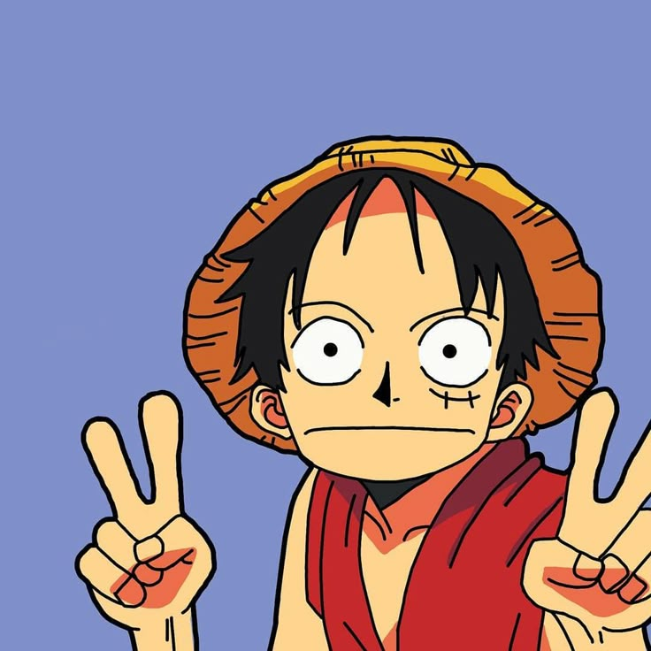

Hello, my name is <u>Sam</u>. i'm just a kind of person who likes to learn every single day of my life. My motto <b>is commit every single day</b>.

<!-- **samsideup/samsideup** is a ✨ _special_ ✨ repository because its `README.md` (this file) appears on your GitHub profile. -->
<!-- Here are some ideas to get you started: -->

<table border="1">
  <thead>
    <th><b>🔭 I’m currently working on</b></th>
    <th><b>🌱 I’m currently learning</b></th>
    <th><b>👯 I’m looking to collaborate on</b></th>
    <th><b>🤔 I’m looking for help with</b></th>
    <th><b>💬 Ask me about</b></th>
    <th><b>📫 How to reach me</b></th>
    <th><b>⚡ Fun fact</b></th>
  </thead>
  
  <tbody>
    <th><b>Bible App (Made in Python)</b></th>
    <th><b>Python, HTML, CSS, JS</b></th>
    <th><b>Any Projects</b></th>
    <th><b>My code, I’m self-taught. I personally don’t know if I’m writing it right or wrong.</b></th>
    <th><b>Anything</th></b>
    <th><b>.samiqi<b></th>
    <th><b>Sometimes i get Jealous when someone out-progress me (i have to change that personally)</b></th>
  </tbody>
</table>
